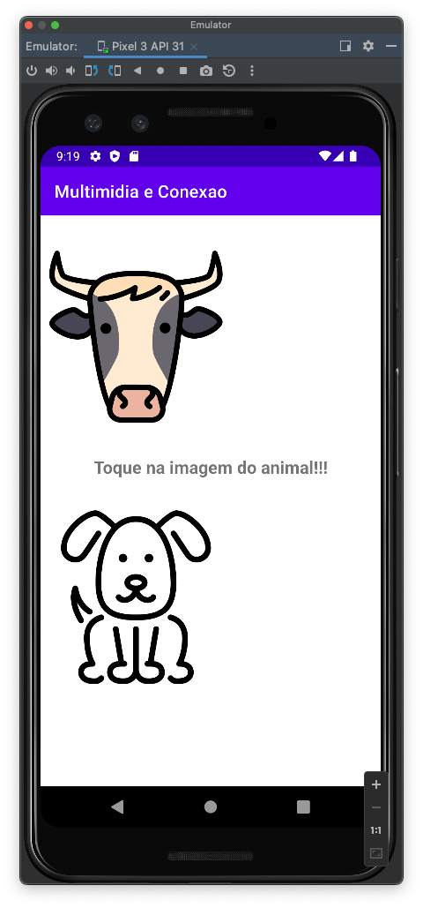

# mob-25-aplicacoes-android-aula5-geo.api_key
# Introdução
Aprofundar os estudos na comunicação externa no dispositivo Android

# Ativdades
- Uso de fotos com imageview;
- Aplicações de som com audiomanager;
- Uso de midias com madiaplayer;
- Animações em views com view animation;
- Usando webview em apps;

# Telas
| Tela 1     | Tela 2     |  
| ------------- | ------------- |
|||
|||
|||

# VersionCode: 1.0

# Authors
Danilo Santos
[@danilopsnts](https://www.linkedin.com/in/danilopsnts/)

